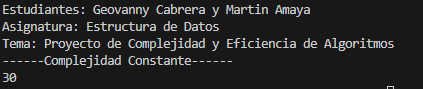
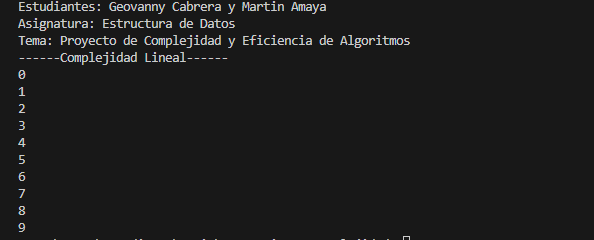
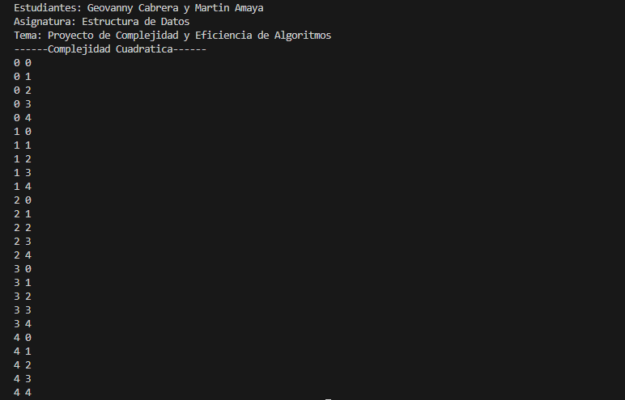
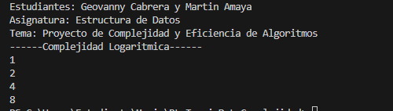
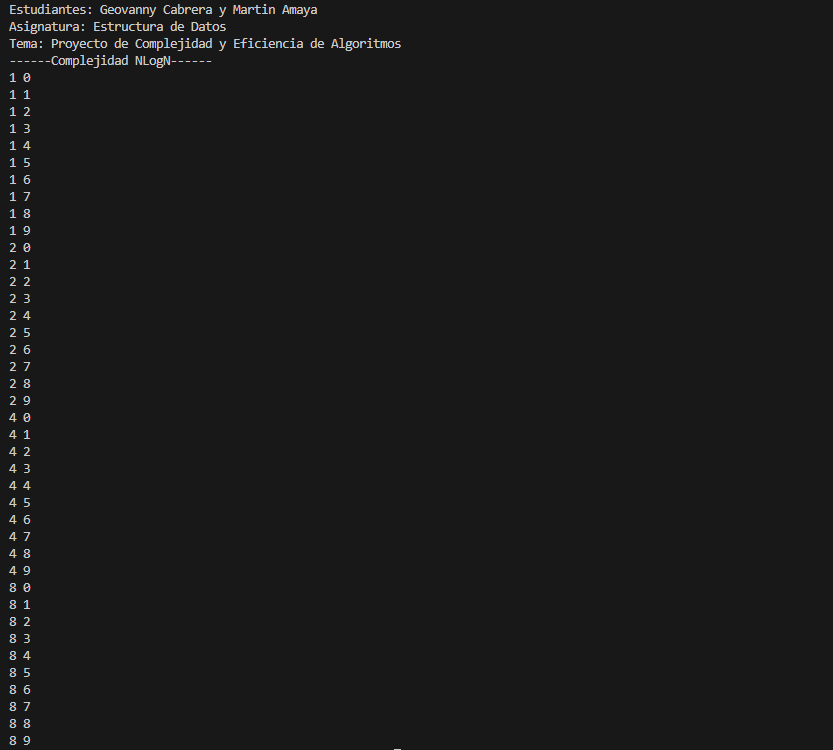

## **2. Ejemplos de Complejidad en Java**

En esta sección se presentan las clases creadas dentro del proyecto y el análisis correspondiente a cada una.

---

## **2.1 Complejidad O(1) – Constante**

### **Archivo:** `ComplejidadConstante.java`

### **Código del ejemplo**

.png>)

### Salida del ejemplo

### **Explicación resumida**

_(Aquí el estudiante explica por qué es O(1))_

## **2.2 Complejidad O(n) – Lineal**

### **Archivo:** `ComplejidadLineal.java`

### **Código del ejemplo**

.png>)

### Salida del ejemplo

### **Explicación resumida**

_(Aquí el estudiante explica por qué es O(n))_

## **2.3 Complejidad O(n^2) – Cuadrática**

### **Archivo:** `ComplejidadCuadratica.java`

### **Código del ejemplo**

.png>)

### Salida del ejemplo

### **Explicación resumida**

_(Aquí el estudiante explica por qué es O(n^2))_

## **2.4 Complejidad O(log n) – Logaritmica**

### **Archivo:** `ComplejidadLogaritmica.java`

### **Código del ejemplo**

.png>)

### Salida del ejemplo

### **Explicación resumida**

_(Aquí el estudiante explica por qué es O(log n))_

## **2.5 Complejidad O(n log n) – Logaritmica**

### **Archivo:** `ComplejidadNLogN.java`

### **Código del ejemplo**

.png>)

### Salida del ejemplo

### **Explicación resumida**

_(Aquí el estudiante explica por qué es O(n log n))_

# **Conclusiones**

**Geovanny Cabrera**:
**Martin Amaya**:
